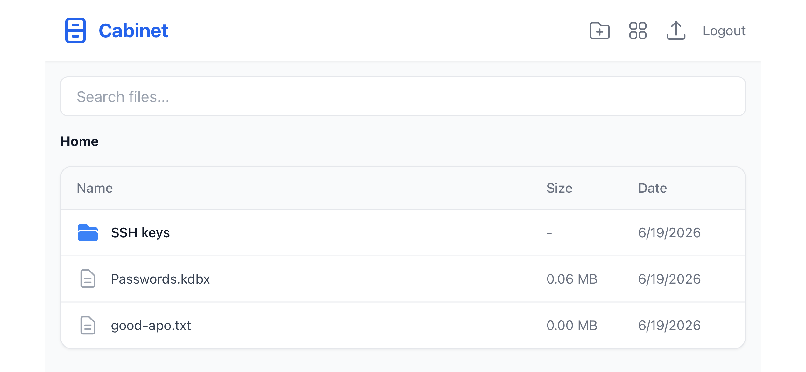
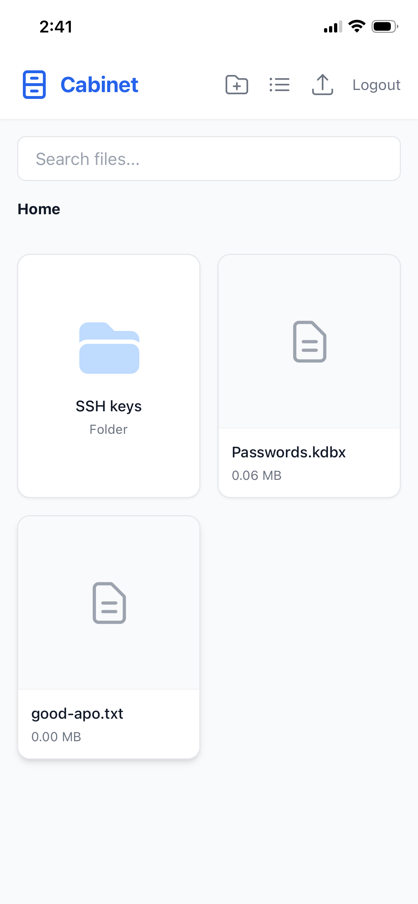

# Cabinet

Cabinet is a lean, self-hosted file locker. It focuses on a fast, mobile-friendly web experience, secure sharing, and high-speed uploads without the bloat of background sync engines.

## Screenshots

Cabinet is optimized for mobile screens and can be added to your home screen as a Progressive Web App (PWA):

### Mobile List View


### Mobile Grid View


## Features

* **Mobile-First UI**: Responsive React frontend with custom bottom-sheet action drawers.
* **On-the-Fly Encryption**: All files are encrypted at rest using AES-256-CTR. Decryption is streamed on-the-fly, supporting random access range requests (like video scrubbing) with zero memory overhead.
* **Smart Previews**: Auto-generated thumbnails for images, videos, and PDFs.
* **Public Sharing**: Generate short link hashes with optional password protection, download count limits, and expiration dates.
* **Single Container**: Frontend, backend, and JSON database run together in one lightweight Docker image.

## Setup & Running

### Environment Variables
Set these variables in your container run config or docker-compose file:
* `JWT_SECRET`: Secret key for session authentication.
  > [!WARNING]
  > If `JWT_SECRET` is not set, it defaults to a public fallback (`'dev-secret-key'`). **Setting a custom, unique JWT secret is mandatory for production deployments** to prevent session forging and unauthorized access to your file locker.
  >
  > You can generate a secure random string by running:
  > ```bash
  > openssl rand -hex 32
  > ```
* `ENCRYPTION_KEY`: Secret key used to encrypt/decrypt physical files at rest.
  > [!WARNING]
  > File encryption is always active. If `ENCRYPTION_KEY` is omitted, Cabinet falls back to a public, insecure default key (`'dev-secret-key'`). **Setting a custom, random key is mandatory for production deployments** to keep files secure on disk.
  >
  > You can generate a secure 256-bit hex key by running:
  > ```bash
  > openssl rand -hex 32
  > ```
* `STORAGE_PATH`: Path to the persistent user storage folder (defaults to `/app/users`).
* `MAX_UPLOAD_SIZE`: Maximum single file size allowed for upload in bytes.
* `REGISTRATION_CODE`: Optional invite/sign-up code. If defined, users registering on the login screen must enter this matching code to successfully create an account. If left blank, registration is open to anyone.

### Quick Start

1. **Build the image**
   ```bash
   docker build -t cabinet .
   ```

2. **Run the container**
   ```bash
   docker run -d \
     -p 4444:4444 \
     -e ENCRYPTION_KEY="your-secure-encryption-key" \
     -e JWT_SECRET="your-secure-jwt-secret" \
     -v $(pwd)/user_data:/app/users \
     cabinet
   ```

3. **Access**
   * Web UI: `http://localhost:4444`
   * Swagger Docs: `http://localhost:4444/api/docs`

### Using Docker Compose

Start the container and map `./user_data` to host storage:
```bash
docker compose up -d --build
```

To run a clean build without cache:
```bash
docker compose build --no-cache && docker compose up -d
```

### Reverse Proxy & SSL

Cabinet is designed to run behind a reverse proxy (like Nginx, Traefik, or Caddy) for SSL termination. The container listens on port `4444`. HSTS and security header enforcements are disabled in Node to let your proxy handle routing and security configuration.

---

## Backups

Because Cabinet packages all configurations and files under a single mapping directory, complete backups are easy. Simply archive the `./user_data` folder on the host:

```bash
tar -czf cabinet-backup-$(date +%F).tar.gz ./user_data
```

---

## Development

1. **Install Dependencies**
   ```bash
   npm install
   ```

2. **Run the Dev Environment**
   This launches the Express backend API and Vite server concurrently:
   ```bash
   npm run dev
   ```