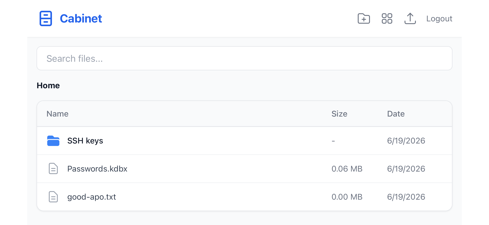
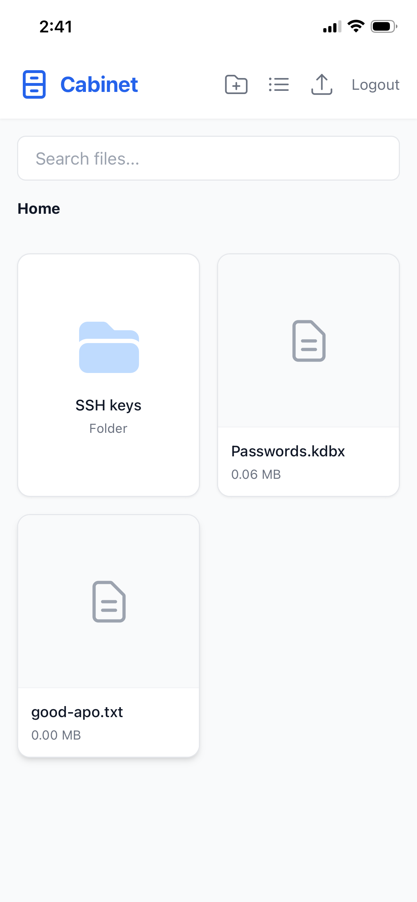

# Cabinet

Cabinet is a lean, self-hosted file locker. It focuses on a fast, mobile-friendly web experience, secure sharing, and high-speed uploads without the bloat of background sync engines.

## Screenshots

Cabinet is optimized for mobile screens and can be added to your home screen as a Progressive Web App (PWA):

### Mobile List View


### Mobile Grid View


## Features

* **Mobile-First UI**: Responsive React frontend with custom bottom-sheet action drawers.
* **Authenticated At-Rest Encryption**: New files use chunked AES-256-GCM so tampering is detected while range requests remain streamable. Existing legacy AES-CTR files remain readable for migration compatibility.
* **Smart Previews**: Auto-generated thumbnails for images, videos, and PDFs.
* **Public Sharing**: Generate short link hashes with optional password protection, download count limits, and expiration dates.
* **Single Container**: Frontend, modular Express backend, and SQLite database run together in one lightweight Docker image.

## Setup & Running

### Environment Variables
Cabinet now fails fast when required security configuration is missing.

* `JWT_SECRET`: Required. At least 32 characters. Generate one with `openssl rand -hex 32`.
* `ENCRYPTION_KEY`: Required. Exactly 64 hexadecimal characters (32 bytes). Generate one with `openssl rand -hex 32`. Keep this key backed up; losing it makes stored files unreadable.
* `ADMIN_PASSWORD`: Required. At least 12 characters. On a fresh install this is used for the bootstrap administrator. Upgraded installs that still use the historical `admin123` password are automatically rotated to this value.
* `ADMIN_USERNAME`: Optional bootstrap administrator username. Defaults to `admin`.
* `ALLOW_REGISTRATION`: Optional. Defaults to `false`. Set to `true` only if open registration is intended.
* `REGISTRATION_CODE`: Optional invite code. When set, registration requires the matching code.
* `STORAGE_PATH`: Persistent storage directory. Defaults to `/app/users` in the container.
* `MAX_UPLOAD_SIZE`: Maximum single-file upload size in bytes.
* `TRUST_PROXY`: Set to `true` when Cabinet is behind a trusted reverse proxy and IP-aware rate limiting should honor the proxy address.

Copy `.env.example` to `.env` and replace every placeholder before using Docker Compose.

### Quick Start

1. **Build the image**
   ```bash
   docker build -t cabinet .
   ```

2. **Run the container**
   ```bash
   docker run -d \
     -p 4444:4444 \
     -e ENCRYPTION_KEY="$(openssl rand -hex 32)" \
     -e JWT_SECRET="$(openssl rand -hex 32)" \
     -e ADMIN_PASSWORD="replace-with-a-strong-password" \
     -v "$(pwd)/user_data:/app/users" \
     cabinet
   ```

3. **Access**
   * Web UI: `http://localhost:4444`
   * Swagger Docs: `http://localhost:4444/api/docs`

### Using Docker Compose

Start the container and map `./user_data` to host storage:
```bash
docker compose up -d --build
```

To run a clean build without cache:
```bash
docker compose build --no-cache && docker compose up -d
```

### Reverse Proxy & SSL

Cabinet is designed to run behind a reverse proxy (like Nginx, Traefik, or Caddy) for TLS termination. The container listens on port `4444`. Set `TRUST_PROXY=true` only when requests reach Cabinet through a trusted proxy.

---

## Backups

Because Cabinet packages all configurations and files under a single mapping directory, complete backups are easy. Simply archive the `./user_data` folder on the host:

```bash
tar -czf cabinet-backup-$(date +%F).tar.gz ./user_data
```

---

## Development

1. **Install Dependencies**
   ```bash
   npm install
   ```

2. **Run the Dev Environment**
   This launches the Express backend API and Vite server concurrently:
   ```bash
   npm run dev
   ```